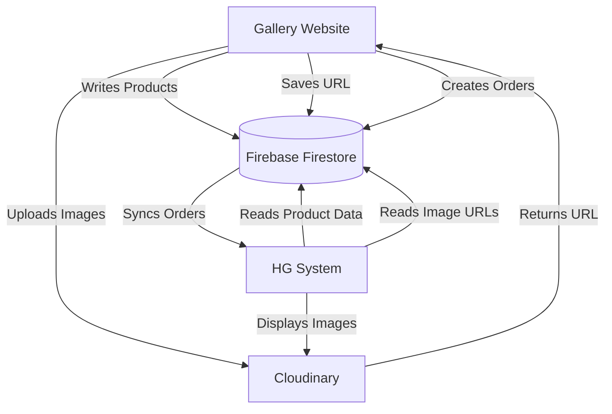

# HG System Integration Guide

This document outlines the technical architecture and integration points between the Gallery Website and the HG System.

## Architecture Overview

The system relies on a **Centralized Database (Firebase Firestore)** and a **Cloud Application Media Storage (Cloudinary)** to synchronize data between the Frontend (Website) and the Backend (HG System).



## 1. Image Handling (Critical)
The Website (both Admin Dashboard and Quick Edit) has been updated to upload all images directly to **Cloudinary**.
- **Old Method:** Images were stored as Base64 strings (causing database bloat and access issues).
- **New Method:** Images are uploaded to Cloudinary, and only the **public URL** (e.g., `https://res.cloudinary.com/...`) is stored in Firestore.

**Constraint For HG System:** 
The HG System **must** be able to display images from remote URLs. It should simply render the URL string found in the database.

## 2. Data Synchronization (Firebase)

The HG System needs to connect to the same Firebase Project using the **Firebase Admin SDK**.

### Product Schema (`products` collection)
The HG System should read from this collection.
```json
{
  "id": "auto-generated-id",
  "name": "Product Name",
  "category": "Category Name",
  "desc": "Description...",
  "code": "ITEM-CODE-123",
  "inStock": true,
  "images": [
    "https://res.cloudinary.com/dbr22ce0m/image/upload/v123456/img1.jpg",
    "https://res.cloudinary.com/dbr22ce0m/image/upload/v123456/img2.jpg"
  ],
  "variants": [
    {
      "name": "Red",
      "inStock": true,
      "images": ["https://res.cloudinary.com/..."]
    }
  ],
  "updatedAt": "Timestamp"
}
```

### Order Schema (`orders` collection - *Future Implementation*)
When a customer checks out on the website, an order document will be created here.
The HG System should listen to this collection for new orders.

## 3. Preparation Checklist

- [x] **Website:** Cloudinary integration completed for Admin Dashboard.
- [x] **Website:** Cloudinary integration completed for Quick Edit (Index).
- [ ] **HG System:** Install Firebase Admin SDK.
- [ ] **HG System:** authenticate with `serviceAccountKey.json` (Needs to be generated from Firebase Console).
- [ ] **HG System:** Implement logic to fetch `products` and map `images[0]` to the item's display image.

## 4. Credentials
*(Securely share these with the HG System Developer)*

**Cloudinary:**
- Cloud Name: `dbr22ce0m`
- Preset: `house_of_glass`

**Firebase:**
- Use the existing Firebase configuration found in `firebase.json` or project settings.

---
**Note:** This architecture allows the HG System to "see" the images effectively because they are now standard Web URLs, accessible from anywhere with internet access.

## 5. System-to-System Integration (Advanced)

We have implemented a dual-provider architecture based on your request.

### A. Gallery as Media Provider
We have created a Vercel Serverless Function to allow the HG System to fetch images by Product Code.

**Endpoint:** `GET /api/media?code=PRODUCT-CODE`
**Response:**
```json
{
  "code": "CUP-101",
  "name": "Luxury Cup",
  "images": ["https://res.cloudinary.com/...", "https://res.cloudinary.com/..."]
}
```

**Deployment Requirement (Critical):**
To make this work on Vercel, you must set the following **Environment Variable** in your Vercel Project Settings:
- Key: `FIREBASE_SERVICE_ACCOUNT`
- Value: *The full content of your firebase-admin-service-account.json file as a string.*

### B. DC as Price Provider
The Gallery Website is now configured to fetch live prices from the Data Center (DC).

1.  **Frontend Logic:** A function `fetchLivePricing()` runs automatically after loading products.
2.  **Visuals:** Product cards now reference `data-code="CODE"` and show a price tag placeholder.
3.  **Connection:** Currently, it is in **Simulation Mode**. To connect it to the real DC:
    *   Open `index.html`.
    *   Find the `fetchLivePricing` function.
    *   Update `const DC_API_URL = null;` to your real endpoint (e.g., `https://your-dc-system.com/api/prices`).

### C. Unique Product Code
We have updated the Admin Dashboard (`admin.html`) to enforce:
*   **Mandatory** Product Code field.
*   **Unique** check (prevents duplicate codes).

This ensures the `code` acts as a reliable Primary Key between both systems.
