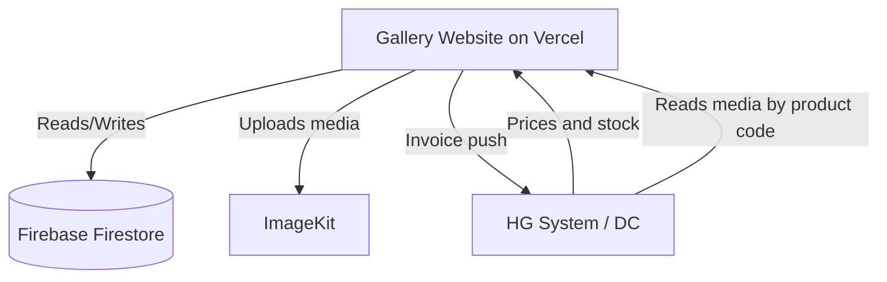

# HG System Integration Guide

This project now follows a Vercel-first runtime model.

## Architecture Overview


```mermaid
graph TD
    A[Gallery Website on Vercel] -->|Reads/Writes| B[(Firebase Firestore)]
    A -->|Uploads media| C[ImageKit]
    D[HG System / DC] -->|Prices and stock| A
    A -->|Invoice push| D
    D -->|Reads media by product code| A
```

## 1. Runtime Boundaries
- Static pages are served by Vercel.
- Server-side endpoints live in the `api/` directory as Vercel Serverless Functions.
- Firebase remains the shared application database.
- ImageKit is the active media provider.
- DC APIs are external and remain critical for prices, stock, and invoice submission.

## 2. DC System Endpoints

### A. Prices and Stock
The gallery expects the DC system to expose pricing and stock by product code.

The frontend now reads those feeds through Vercel proxy routes instead of calling the DC host directly from the browser.

Suggested request:
```json
{
  "codes": ["CUP-101", "PLATE-505", "VASE-99"]
}
```

Suggested response:
```json
{
  "CUP-101": { "price": 1500, "stock": 5 },
  "PLATE-505": { "price": 400, "stock": 20 },
  "VASE-99": { "price": 0, "stock": 0 }
}
```

### B. Invoice Submission
Invoice handoff from the gallery to the DC system is handled through:

- `api/integrations/online-invoices.js`

This endpoint depends on these Vercel environment variables:
- `DC_ONLINE_INVOICE_URL`
- `DC_ONLINE_INVOICE_API_KEY`

Do not hardcode DC credentials in frontend files or serverless code.

## 3. Gallery as Media Provider
The HG system can fetch product media from the Vercel API by product code.

Endpoint:
```http
GET https://your-vercel-domain/api/media?code=PRODUCT-CODE
```

Example response:
```json
{
  "code": "CUP-101",
  "name": "Luxury Cup",
  "images": ["https://ik.imagekit.io/..."],
  "variants": []
}
```

Required Vercel environment variable:
- `FIREBASE_SERVICE_ACCOUNT`

## 4. Product Identity Rules
- Product `code` must stay mandatory.
- Product `code` must stay unique.
- DC and gallery must use the exact same code values.

This code is the primary link between prices, stock, images, and invoices.

## 5. Media Notes
- Active uploads go to ImageKit.
- Legacy product records may still contain Cloudinary URLs and should be treated as backward-compatible media.
- External systems should be ready to display any valid remote HTTPS image URL returned by the gallery.

## 6. Vercel Deployment Requirements
Set these variables in Vercel project settings before production deployment:
- `FIREBASE_SERVICE_ACCOUNT`
- `IMAGEKIT_PRIVATE_KEY`
- `IMAGEKIT_PUBLIC_KEY`
- `IMAGEKIT_URL_ENDPOINT`
- `DC_ONLINE_INVOICE_URL`
- `DC_ONLINE_INVOICE_API_KEY`
- `DC_PUBLIC_PRODUCTS_URL`
- `DC_PUBLIC_STOCK_URL`
- `SERVER_STATUS_DATABASE_URL` or `DATABASE_URL`
- `SERVER_STATUS_DATABASE_SSL`
- `LOCAL_SERVER_STATUS_URL`

## 7. n8n Integration With Local WhatsApp API

You now have a working self-hosted WhatsApp API behind this public base URL:

- `https://whapp.hg-alshour.online`

### A. Recommended Workflow Shape
1. `Schedule Trigger`
2. `Google Firebase Cloud Firestore`
3. `Code` (JavaScript)
4. `HTTP Request`

### B. Send Text Message
- `POST https://whapp.hg-alshour.online/api/sendText`

### C. Send Image + Caption
- `POST https://whapp.hg-alshour.online/api/sendImage`