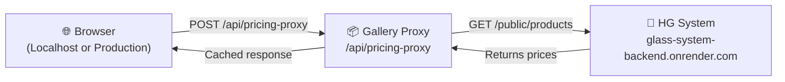

# Pricing Proxy API Guide

## Overview

**Pricing Proxy** هو middleware بين الـ Gallery Website والـ HG System بيحل مشاكل:
- ❌ CORS errors من الـ Browser
- ❌ Domain Whitelist restrictions
- ❌ Performance issues (مع caching)
- ❌ Security concerns

## Architecture



## Endpoints

### Request

```http
POST /api/pricing-proxy
Content-Type: application/json

{
  "codes": ["CUP-101", "PLATE-505", "VASE-99"]
}
```

### Response (Success)

```json
{
  "cached": false,
  "data": {
    "CUP-101": {
      "price": 1500,
      "stock": 5,
      "wholesale": 1200,
      "discount": 0
    },
    "PLATE-505": {
      "price": 400,
      "stock": 20,
      "wholesale": 300,
      "discount": 50
    },
    "VASE-99": null
  },
  "timestamp": "2026-02-26T12:00:00.000Z"
}
```

### Response (HG System Down - Stale Cache)

```json
{
  "cached": true,
  "stale": true,
  "data": { ... },
  "warning": "Using cached data - HG System unavailable",
  "timestamp": "2026-02-26T12:00:00.000Z"
}
```

## Features

### ✅ Performance Optimization

**Caching Strategy:**
- **TTL (Time To Live):** 5 minutes (300,000ms)
- **Stale Cache Fallback:** If HG System is down, uses last known good data
- **In-Memory Cache:** Lightning fast subsequent requests

```javascript
// Example timing:
// Request 1: 2400ms (fetches from HG System)
// Request 2 (within 5m): 15ms (from cache)
// HG System down: Returns stale data + warning
```

### 🔒 Security Features

1. **CORS Whitelist (Domain Verification)**
   - ✅ Production: `https://house-of-glass-phi.vercel.app`
   - ✅ Development: `localhost:3000`, `localhost:8000`, `localhost:5000`
   - ❌ Any other domain: Blocked

2. **Input Validation**
   - Maximum 100 codes per request
   - All codes must be non-empty strings
   - Array format enforced

3. **Security Headers**
   - `X-Content-Type-Options: nosniff`
   - `X-Frame-Options: DENY`
   - `Access-Control-Max-Age: 3600` (Preflight caching)

4. **Timeout Protection**
   - 10 second timeout for HG System calls
   - Prevents hanging requests

### 🚨 Error Handling

| Scenario | Behavior |
|----------|----------|
| **Normal request** | Fresh data from HG System |
| **HG error (with cache)** | Returns cached data + `stale: true` + warning |
| **HG error (no cache)** | 503 Service Unavailable |
| **Invalid input** | 400 Bad Request + error message |
| **CORS violation** | Request blocked at browser level |
| **Network timeout** | Falls back to stale cache |

## Integration Guide

### In index.html & admin.html

**Old (Direct - causes CORS issues):**
```javascript
const res = await fetch("https://glass-system-backend.onrender.com/public/products");
```

**New (Via Proxy - works everywhere):**
```javascript
const res = await fetch("/api/pricing-proxy", {
    method: 'POST',
    headers: { 'Content-Type': 'application/json' },
    body: JSON.stringify({ codes: codesArray })
});

const data = await res.json();
const priceMap = data.data; // Contains prices by code
```

## Deployment

### Requirements

1. **Vercel Environment Variable**
   - Key: `FIREBASE_SERVICE_ACCOUNT`
   - Value: Firebase service account JSON (stringified)

2. **File Structure**
   ```
   api/
   ├── media.js              (Product images by code)
   ├── pricing-proxy.js      (Prices via HG System)
   └── ...
   ```

### Deployment Checklist

- [x] `/api/pricing-proxy.js` file created
- [ ] Update `vercel.json` (if needed)
- [ ] Test via `https://house-of-glass-phi.vercel.app`
- [ ] Verify caching works (requests should be < 50ms)

## Monitoring & Debugging

### Check if Proxy is Working

```bash
curl -X POST http://localhost:8000/api/pricing-proxy \
  -H "Content-Type: application/json" \
  -d '{"codes": ["CUP-101"]}'
```

### Console Logs

The proxy logs important events:
```
📦 Using cached prices (5min TTL)
🔄 Fetching fresh prices from HG System...
✅ Cached 456 products
⚠️ HG System error, falling back to stale cache
```

### Browser DevTools

In Network tab, look for:
```
POST /api/pricing-proxy   200 OK   15ms
```

(After first request, should be < 50ms due to caching)

## Future Improvements

### Optional Enhancements

1. **Redis/Memcached Integration**
   - Persistent cache across server restarts

2. **Rate Limiting**
   - Prevent abuse (e.g., max 100 requests/minute per IP)

3. **Analytics**
   - Track HG System uptime/downtime
   - Monitor cache hit ratio

4. **Webhook Support**
   - HG System notifies when prices change
   - Real-time cache invalidation

## Troubleshooting

### "Prices not showing on localhost"

**Problem:** Proxy not loaded in development

**Solution:**
```bash
# Make sure local server is running
python -m http.server 8000
```

### "CORS error still appears"

**Problem:** Browser cache or whitelist issue

**Solutions:**
1. Hard refresh (Ctrl+Shift+R)
2. Check if localhost is in whitelist
3. Verify port matches (e.g., 8000, not 3000)

### "Always getting stale cache"

**Problem:** HG System is returning errors

**Solution:**
1. Verify HG System is online: `curl glass-system-backend.onrender.com/public/products`
2. Check network connectivity
3. Monitor the proxy logs

## Contact

الأسعار والـ الصور الحالية: **proxied securely** ✨

لو في مشكلة: بلغنا فوراً!
